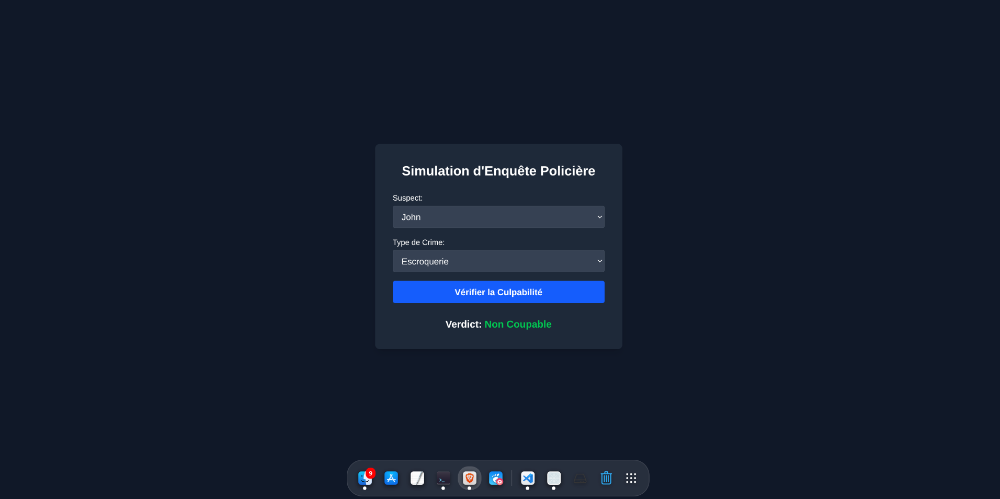

# Simulation d'Enquête Policière avec Prolog, React et Vite




### Introduction
Ce projet, développé dans le cadre d’un exercice académique (IA MI G2 IG), s’appuie sur la programmation logique avec **Prolog** pour modéliser des enquêtes judiciaires.  
L’objectif est de déterminer la culpabilité d’un suspect selon des faits établis (motif, empreintes, présence sur la scène du crime, etc.) et des règles définies.  

Le **frontend**, construit avec **React** et **Vite**, offre une interface fluide et intuitive, tandis que le **backend**, basé sur **Node.js**, exécute les requêtes Prolog pour fournir des verdicts.  
Ce projet illustre la synergie entre IA et développement web, dans une approche éducative et ludique.

---

### Objectif du Projet
L’application permet de simuler une enquête en sélectionnant :
- un **suspect**,
- un **type de crime** (assassinat, vol ou escroquerie).  

Les règles logiques en Prolog évaluent les faits disponibles afin de rendre un verdict clair et automatisé.  
L’interface présente le résultat de façon visuelle et pédagogique.

---

### Fonctionnalités Principales
- **Sélection des Suspects** : Choisissez parmi une liste de personnages (John, Mary, Alice, Bruno, Sophie).  
- **Types de Crimes** : Évaluez différents crimes (*assassinat, vol, escroquerie*) avec leurs critères.  
- **Verdict Automatique** : Obtenez instantanément un résultat — *Coupable* ou *Non Coupable*.  
- **Interface Moderne** : Une UI réactive et esthétique grâce à **React**, **Vite** et **TailwindCSS**.  

---

### Structure du Projet

#### 📂 Backend
- Contient la logique serveur (Node.js).  
- Le fichier principal `server.js` reçoit les requêtes du frontend, exécute Prolog via **SWI-Prolog**, puis retourne les verdicts.  
- Assure la communication entre la logique IA et l’interface utilisateur.  

#### 📂 Frontend
- Développé avec **React + Vite**.  
- Inclut des composants réutilisables : sélection de suspects, choix du crime, affichage des résultats.  
- Stylisé avec **TailwindCSS** pour un rendu ergonomique et moderne.  

#### 📄 investigation.pl
- Situé dans `backend/`.  
- Cœur de la logique IA.  
- Définit les types de crimes, suspects, faits et règles de culpabilité.  
- Exploité par le backend pour générer les verdicts.  

---

### Prérequis
Avant de lancer le projet, assurez-vous d’avoir installé :  

- [Node.js](https://nodejs.org/) (version 16 ou plus recommandée)  
- [npm](https://www.npmjs.com/) ou [yarn](https://yarnpkg.com/)  
- [SWI-Prolog](https://www.swi-prolog.org/) (indispensable pour exécuter les règles logiques)  
- [Git](https://git-scm.com/) (pour cloner le dépôt)  

---

### Instructions pour le Professeur
Cher professeur, vous êtes invité à :

1. **Explorer** le code source dans les dossiers `backend/` et `frontend/`.  
2. **Tester** l’application en lançant :  
   ```bash
   # Lancer le backend
   node server.js

   # Lancer le frontend
   npm run dev
   ```
3. **Consulter** les logs du backend pour diagnostiquer les éventuels problèmes.  
4. **Donner un retour** via les issues ou en soumettant un pull request.  

Un lien d’invitation GitHub vous a été transmis pour accéder au dépôt.  

---

### Contribution et Améliorations
Le projet reste ouvert aux évolutions :  
- Ajout de faits et de règles dans `investigation.pl`.  
- Amélioration de l’interface utilisateur (statistiques, détails d’enquête, meilleure ergonomie).  
- Optimisation du backend et gestion avancée des warnings Prolog.  

---

### Remerciements
Un grand merci à notre professeur pour son accompagnement et son enseignement.  
Nous avons apprécié la possibilité d’appliquer nos compétences en IA et développement web à travers ce projet enrichissant.  

---

### Équipe du Projet
- VAZONIAINA Funny Bienvenu 1424H-F
- HARINOMENJANAHARY Aldice 1579H-F
- RALILAMANANJARA Mbolatiana 1568H-F
- RANDRIAKAMAMY Fabien Elyote 1557H-F
- RAMADIMANDIMBY Andriamirado Constant 1428H-F
- TODIZARA Amoros 1461H-F 
